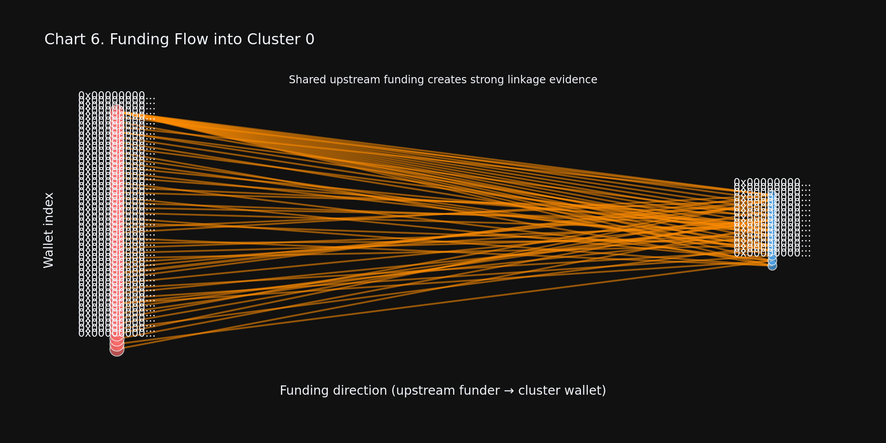

# onchain-sybil-detector
Detect coordinated multi-wallet abuse on any EVM chain. Evidence-driven. Explainable. Open source.


## Problem
Sybil abuse is one of the highest-impact threats for:
- airdrops
- quest/reward systems
- referral programs
- faucet systems
- exchange promotions

Enterprise Sybil tooling can cost $100k+/year.
This project is an open-source alternative designed for reproducible, evidence-driven investigations.

## 📊 Case Study: Cleaning a DeFi Airdrop

See an example of use cases, full investigation with interactive visualizations:  
**→ [Case Study Notebook](notebooks/case_study_airdrop_sybils.ipynb)**

for few some use cases look at Case Study Notebook


**All 15 wallets are funded from 0x0000000000000000000000000000000000f00000 within 24690.9 minutes.**

Covers: campaign scanning, cluster deep-dive (timeline, gas fingerprint, funding flow), airdrop hunter mode, and adversarial resilience testing across 8 difficulty levels.

## What This Project Is
`onchain-sybil-detector` is a behavioral clustering framework for EVM wallets.
It focuses on:
- offline-first operation with synthetic data
- explainable outputs suitable for analyst workflows
- reusable CLI and Python APIs
- multi-chain support for major EVM ecosystems

## Core Pipeline
```text
Data Ingestion -> Feature Engineering -> Clustering -> Coordination Scoring -> Analyst Report
```

```text
+-------------------+    +----------------------+    +----------------------+    +----------------------+    +----------------------+
| Data Ingestion    | -> | Feature Engineering  | -> | HDBSCAN Clustering   | -> | Evidence Scoring     | -> | Analyst Report       |
| RPC/API/cache     |    | 25 core behavioral features + 24 temporal histogram features |    | + refinement gates   |    | timing/gas/funding   |    | HTML/JSON/Markdown   |
+-------------------+    +----------------------+    +----------------------+    +----------------------+    +----------------------+
```

## High-Level Architecture Notes
- Data layer supports cache + optional explorer APIs.
- Feature layer computes one row per address.
- Clustering layer uses robust scaling + HDBSCAN.
- Coordination scoring combines multiple independent evidence channels.
- Report layer emits machine-readable and analyst-readable artifacts.

## Installation
Requires Python 3.9+ — check with `python3 --version`.

```bash
git clone https://github.com/KOKOSde/onchain-sybil-detector.git
cd onchain-sybil-detector
python3 -m pip install -e .
```

## Setup: API Keys (Optional)
The project works out of the box without keys using synthetic data.

For optional live chain fetching:
- Etherscan-family key: https://etherscan.io/myapikey
- Alchemy key: https://dashboard.alchemy.com/signup

```bash
cp .env.example .env
# edit .env with your own keys
export ETHERSCAN_API_KEY=your_key
export ALCHEMY_API_KEY=your_key
```

## Quickstart (Python API)
```python
from sybil_detector.datasets.synthetic_generator import generate_synthetic_sybil_network
from sybil_detector import SybilDetector, extract_features, run_benchmark

tx, labels = generate_synthetic_sybil_network(seed=42)
features = extract_features(tx)
detector = SybilDetector(min_cluster_size=3, min_samples=2)
predictions = detector.fit_predict(features)
metrics = run_benchmark(detector, tx, labels)
flagged = predictions[predictions["sybil_probability"] >= metrics["decision_threshold"]]
print(flagged[["address", "cluster_id", "sybil_probability"]].head())
```

## Quickstart (CLI)
```bash
python3 -m sybil_detector.cli_osd simulate --difficulty 1 --num-clusters 5 --wallets-per-cluster 10 --out /tmp/osd_synthetic.csv
python3 -m sybil_detector.cli_osd scan --addresses /tmp/osd_synthetic.csv --chain eth --out /tmp/osd_report.html
python3 -m sybil_detector.cli_osd benchmark --out /tmp/osd_benchmark.csv
```

## Feature Catalog (25 core behavioral features + 24 temporal histogram features)
### Temporal
1. `hour_of_day_entropy`
2. `day_of_week_entropy`
3. `median_inter_tx_time_sec`
4. `std_inter_tx_time_sec`
5. `burst_ratio`
6. `first_tx_timestamp`
7. `active_days`
8. `activity_span_days`

### Gas
9. `median_gas_price`
10. `gas_price_cv`
11. `gas_price_mode_ratio`
12. `median_gas_used`
13. `gas_efficiency`

### Value
14. `median_value_wei`
15. `value_entropy`
16. `round_number_ratio`
17. `unique_value_count`

### Graph
18. `unique_counterparties`
19. `in_degree`
20. `out_degree`
21. `self_loop_count`
22. `common_funder_address`

### Fund Flow
23. `pct_funds_from_top_source`
24. `time_to_first_outgoing_sec`
25. `funding_source_count`

## Detection Logic
Clustering and scoring use:
- temporal correlation
- gas strategy similarity
- common funding concentration
- sequential activity correlation

Sybil probability combines:
- cluster-level coordination evidence
- local address-specific behavioral flags

## Airdrop Hunter Mode
A dedicated workflow for campaign abuse analysis. The real Python entry points are `run_airdrop_hunter()` and `scan_airdrop_campaign()`.

Targets:
- airdrops
- quest/task participation farming
- faucet abuse
- referral abuse
- incentive farming

Python example:
```python
from sybil_detector.datasets.synthetic_generator import generate_synthetic_sybil_network
from sybil_detector.airdrop_hunter_osd import run_airdrop_hunter

tx, _ = generate_synthetic_sybil_network(seed=42)
participants = tx["address"].drop_duplicates().head(10).tolist()
result = run_airdrop_hunter(participant_addresses=participants, transactions=tx, chain="base")
print(result["campaign_summary"])
```

Output includes:
- likely farmer clusters
- per-wallet suspicion scores
- campaign-level abuse estimate
- marginally-linked members

## Multi-Chain Support
| Chain | Alias | Explorer API Base | Typical Block Time |
|---|---|---|---:|
| Ethereum | `eth` | `https://api.etherscan.io/v2/api?chainid=1` | 12.0s |
| Base | `base` | `https://api.etherscan.io/v2/api?chainid=8453` | 2.0s |
| BNB Chain | `bnb`, `bsc` | `https://api.etherscan.io/v2/api?chainid=56` | 3.0s |
| Arbitrum | `arb` | `https://api.etherscan.io/v2/api?chainid=42161` | 0.26s |
| Optimism | `op` | `https://api.etherscan.io/v2/api?chainid=10` | 2.0s |
| Polygon | `matic` | `https://api.etherscan.io/v2/api?chainid=137` | 2.1s |

Cross-chain signals include:
- bridge timing correlation
- mirrored gas behavior
- synchronized active-hour windows
- repeated wallet-generation patterns
- common funding sources across chains

Public chain list API:
- `sybil_detector.chains_osd.SUPPORTED_CHAINS`
- `sybil_detector.chains_osd.list_supported_chains()`

## CLI Example Output
All snippets below come from real files in `demo_outputs_osd/`.

### `simulate` Example Output
Source: `demo_outputs_osd/cli_simulate_example_output.txt`

```text
$ python3 -m sybil_detector.cli_osd simulate --difficulty 1 --num-clusters 5 --wallets-per-cluster 10 --out /tmp/osd_synthetic.csv
{"transactions": "/tmp/osd_synthetic.csv", "labels": "/tmp/osd_synthetic_labels.csv", "rows": 14536}
$ python3 - <<"PY"
import pandas as pd
tx = pd.read_csv("/tmp/osd_synthetic.csv")
print(tx.shape)
print(tx[["address","tx_hash","timestamp"]].head(3).to_string(index=False))
(14536, 11)
                                   address                                                            tx_hash  timestamp
0x0000000000000000000000000000000000a00000 0x0000002a000000000000000000000000000000000000000000000000000019f7 1704068565
0x0000000000000000000000000000000000f00000 0x0000002a000000000000000000000000000000000000000000000000000019f7 1704068565
0x0000000000000000000000000000000000a00001 0x0000002a00000000000000000000000000000000000000000000000000001a06 1704068759
```

### `scan` Example Output
Source: `demo_outputs_osd/cli_scan_example_output.txt`

```text
$ python3 -m sybil_detector.cli_osd scan --addresses /tmp/osd_synthetic.csv --chain eth --out /tmp/osd_report.html
{"output": "/tmp/osd_report.html", "clusters": 5}
$ python3 - <<"PY"
from pathlib import Path
html = Path("/tmp/osd_report.html").read_text()
print("clusters_tag", "Clusters analyzed:" in html)
print("has_graph", "vis.Network" in html)
clusters_tag True
has_graph True
```

### `benchmark` Example Output
Source: `demo_outputs_osd/cli_benchmark_example_output.txt`

```text
$ python3 -m sybil_detector.cli_osd benchmark --out /tmp/osd_benchmark.csv
{"output": "/tmp/osd_benchmark.csv", "levels": 8}
$ head -n 6 /tmp/osd_benchmark.csv
level,address_precision,address_recall,address_f1,cluster_precision,cluster_recall,cluster_f1,n_predicted_sybil_addresses
level_1,0.9917355371900827,1.0,0.995850622406639,1.0,1.0,1.0,121.0
level_2,1.0,0.8833333333333333,0.9380530973451328,1.0,0.9,0.9473684210526316,106.0
level_3,0.96,0.2,0.3310344827586207,1.0,0.2,0.33333333333333337,25.0
level_4,0.9917355371900827,1.0,0.995850622406639,1.0,1.0,1.0,121.0
level_5,0.9917355371900827,1.0,0.995850622406639,1.0,0.25,0.4,121.0
```

## Adversarial Benchmark Results
Source: `demo_outputs_osd/adversarial_benchmark.json` and generated via `scripts/generate_benchmark_table.py`.

<!-- ADVERSARIAL_TABLE_START -->
| Difficulty | Description | Precision | Recall | F1 | Detection Rate |
|---|---|---:|---:|---:|---:|
| Level 1 | Naive (same funder/gas/timing) | 1.0000 | 1.0000 | 1.0000 | 100.00% |
| Level 2 | Randomized timing | 1.0000 | 0.9625 | 0.9809 | 96.25% |
| Level 3 | Indirect funding (2-hop) | 1.0000 | 0.7500 | 0.8571 | 75.00% |
| Level 4 | Mixed gas behavior | 1.0000 | 1.0000 | 1.0000 | 100.00% |
| Level 5 | Intentional cluster splitting | 1.0000 | 1.0000 | 1.0000 | 100.00% |
| Level 6 | Chain hopping | 1.0000 | 1.0000 | 1.0000 | 100.00% |
| Level 7 | Burner wallets | 1.0000 | 0.9091 | 0.9524 | 90.91% |
| Level 8 | Delayed coordination | 1.0000 | 1.0000 | 1.0000 | 100.00% |
<!-- ADVERSARIAL_TABLE_END -->

Detection Rate is computed as `recall * 100` from the benchmark artifact.
Results from `generate_adversarial_sybils(seed=42)` with 8 clusters of 10 wallets each. Level 3 (indirect funding) remains the hardest case in this run.

## Interpretation of Adversarial Results
- Levels 1/2/4/5/6 remain highly detectable in this synthetic setup.
- Level 3 is now recoverable but still materially harder than Level 1/2 due indirect relay funding.
- Level 7 shows measurable degradation under burner-wallet behavior.
- Level 8 delayed-coordination is now recoverable after delayed-cadence coordination scoring updates.

## Analyst Report Mode
The report system emits three formats:
- markdown
- json
- html (with embedded graph)

Main artifacts:
- `demo_outputs_osd/reports/osd_demo_analyst_report.md`
- `demo_outputs_osd/reports/osd_demo_analyst_report.json`
- `demo_outputs_osd/reports/osd_demo_analyst_report.html`
- `demo_outputs_osd/reports/osd_demo_graph.html`

### Analyst Report Snippet (Real Output)
Source: `demo_outputs_osd/reports/osd_demo_analyst_report.md`

```text
# Analyst Report (osd_demo)

Generated at: 2026-03-22T10:46:01.690139+00:00
Clusters analyzed: 10

## Cluster 7
- Wallet count: 19
- Confidence score: 0.825
- Timeline: {'first_tx': '2024-01-19T00:43:35+00:00', 'peak_activity': '2024-01-19T01:00:00+00:00', 'last_tx': '2024-02-06T00:45:12+00:00', 'peak_hour_count': 28}
- Funding summary: {'external_funding_edges': 84, 'top_funders': [{'wallet': '0x0000000000000000000000000000000000f00006', 'funded_wallet_events': 38}, ...]}
- Gas summary: {'median_gas_price': 18226739738.5, 'gas_price_cv': 0.06383394383822251, 'median_gas_used': 51678.0, 'strategy_similarity': 0.6000924509580445}
- Strongest evidence: [{'evidence_type': 'common_funding', 'score': 1.0}, {'evidence_type': 'gas_similarity', 'score': 0.9840006572099679}, ...]
- Summary: Cluster 7: 19 wallets funded by 0x0000000000000000000000000000000000f00006 within 25921.6 minutes, confidence=0.83, gas CV=0.064.
```

## Why These Wallets Are Linked
Source: `demo_outputs_osd/explainer_two_wallets_osd.txt`

```json
{
  "wallets": [
    "0x0000000000000000000000000000000000a00000",
    "0x0000000000000000000000000000000000a00001"
  ],
  "evidence_sentences": [
    "Funded from same upstream wallet (0x0000000000000000000000000000000000f00000) within 3.2 minutes.",
    "Transact in same minute-buckets across 27 windows.",
    "Near-identical gas strategy (median gas_price CV=0.003, gas_used CV=0.004).",
    "Recurring contract interaction sequence similarity: 1.00."
  ],
  "confidence_score": 0.9000000000000001,
  "linkage_strength": "strong"
}
```

## Graph Rendering Notes
The graph output is generated via pyvis with CDN resources:
- `Network(cdn_resources='remote')`
- `generate_html()`

The analyst HTML embeds graph HTML directly via `srcdoc`.
This avoids broken relative `lib/` references and keeps graph content visible in a single report file.

## Benchmark vs Naive Baselines (Synthetic)
Source: `demo_outputs_osd/synthetic_benchmark_osd.json`

| Method | Precision | Recall | F1 |
|---|---:|---:|---:|
| OSD detector (address-level) | 1.000 | 0.830 | 0.907 |
| Naive baseline: same funder | 0.100 | 0.500 | 0.167 |
| Naive baseline: same gas | 0.780 | 0.745 | 0.762 |
| Naive baseline: same timing | 0.655 | 0.645 | 0.650 |

## Running Tests
Primary test command:
```bash
pytest tests/ -v --tb=short
```

Captured output file:
- `demo_outputs_osd/test_output_osd_final.txt`

## Demo Artifacts Directory
`demo_outputs_osd/` contains:
- CLI transcripts
- benchmark outputs
- regenerated analyst reports
- notebook execution logs
- synthetic benchmark JSON
- adversarial benchmark JSON
- final pytest transcript

## Notebook Compatibility
`notebooks/case_study_airdrop_sybils.ipynb` now saves static PNG outputs in `notebooks/images/` for GitHub rendering while keeping local interactive Plotly charts.
Analyst report outputs use CDN-based `vis-network` references with no root `lib/` dependency.

## Common Workflows
### Run full offline demo
```bash
python3 -m sybil_detector.cli_osd simulate --difficulty 1 --num-clusters 5 --wallets-per-cluster 10 --out /tmp/osd_synthetic.csv
python3 -m sybil_detector.cli_osd scan --addresses /tmp/osd_synthetic.csv --chain eth --out /tmp/osd_report.html
python3 -m sybil_detector.cli_osd benchmark --out /tmp/osd_benchmark.csv
```

### Run lint and tests
```bash
make lint
make test
```

### Explain wallet linkage
```python
from sybil_detector.datasets.synthetic_generator import generate_synthetic_sybil_network
from sybil_detector.explainer_osd import explain_wallet_linkage

tx, _ = generate_synthetic_sybil_network(seed=42)
wallets = tx["address"].drop_duplicates().head(2).tolist()
result = explain_wallet_linkage(wallets=wallets, transactions=tx)
print(result["confidence_score"], result["evidence_sentences"])
```

## Who This Is For
- Exchange trust and safety teams
- DeFi protocol risk teams
- Airdrop designers
- Security researchers
- DAO governance participants

## Limitations
- Adversarial Level 3 (indirect 2-hop funding) remains a harder case than direct-funding levels.
- Results depend on the representativeness of synthetic generators and labeled datasets.
- Cross-chain linkage remains heuristic and should be combined with analyst review.

## Roadmap Ideas
- stronger indirect-funding path detection
- automatic feature ablation reports
- supervised calibration layer for per-wallet risk
- richer bridge event normalization
- improved false-positive controls on high-frequency bots

## Related Projects
- identity-risk-engine: https://github.com/KOKOSde/identity-risk-engine
- LocalMod: https://github.com/KOKOSde/LocalMod

## Contributing
Contributions are welcome.

Suggested contribution style:
- keep PRs focused
- include tests for new behavior
- include offline reproducibility for demos
- include regression checks for explainability output

## Citation
If this project helps your research, reference the repository and include the benchmark artifact versions used.

## Security and Ethics
This tool is for abuse detection, risk analysis, and security research.
Do not use this project for unauthorized surveillance or harmful profiling.

## License
MIT
